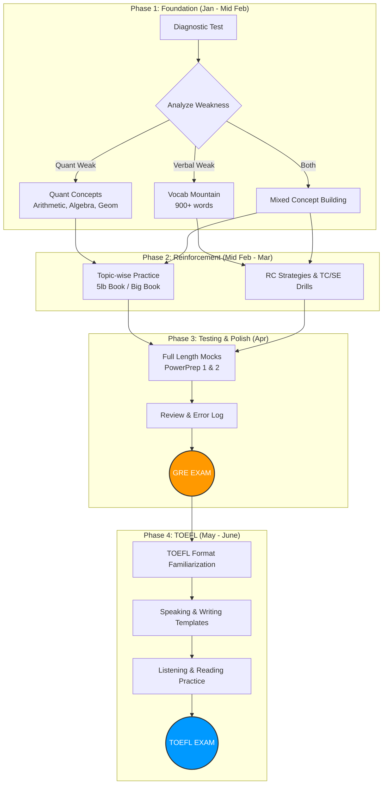
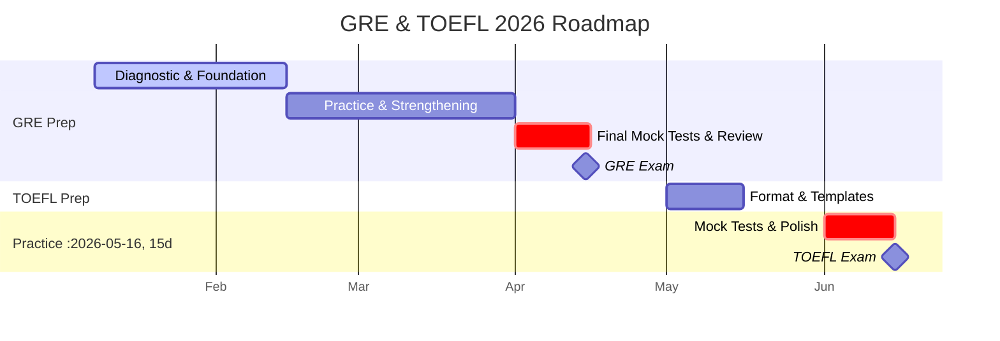

# 🎓 GRE & TOEFL Preparation Dashboard

## 🎯 Target Scores

| Exam | Target Score | Section Breakdown |
|:---|:---:|:---|
| **GRE** | **325+** | Quant: 165+ / Verbal: 160+ |
| **TOEFL iBT** | **110+** | R:28+ / L:28+ / S:26+ / W:28+ |

> [!TIP]
> IELTS 8 ≈ TOEFL 108-114. Aiming for 110+ keeps you competitive for top universities.

---

## 📊 Executive Summary

| **Exam** | **Target Date** | **Estimated Cost (USD)** | **Estimated Cost (BDT)** |
| :--- | :--- | :--- | :--- |
| **GRE** | **April 2026** | ~$220 | ~৳26,950 |
| **TOEFL** | **June 2026** | ~$205 | ~৳25,113 |
| **Total** | | **~$425** | **~৳52,063** |

> [!NOTE]
> *   **Exchange Rate Used**: $1 = ৳122.5 (Average market rate as of Jan 7, 2026).
> *   **Buffer**: It is recommended to keep a buffer of ~৳5,000 for bank transaction fees and potential rate fluctuations.

---

## ⏰ Daily Study Schedule

### Recommended: 3-4 Hours/Day

| Time Block | Duration | Focus Area | Best For |
|:---|:---:|:---|:---|
| **Morning** (7:00-8:30 AM) | 1.5 hrs | Vocabulary + Reading | Fresh mind for memorization |
| **Evening** (7:00-9:00 PM) | 2 hrs | Quant Practice + Review | Problem-solving after work |
| **Weekend Bonus** | +2 hrs | Full Section Practice | Timed mock sections |

### Weekly Hour Distribution

| Day | Quant | Verbal | AWA | Total |
|:---:|:---:|:---:|:---:|:---:|
| Mon-Fri | 1 hr | 1.5 hrs | - | 2.5 hrs |
| Saturday | 2 hrs | 2 hrs | 1 hr | 5 hrs |
| Sunday | 1.5 hrs | 1.5 hrs | - | 3 hrs |
| **Weekly Total** | **8 hrs** | **11 hrs** | **1 hr** | **~20 hrs** |

> [!IMPORTANT]
> **First Week Priority**: Take a diagnostic test to identify your strengths and weaknesses before starting the detailed study plan.

---

## 📅 Phase 1: Diagnostic & Foundation (Jan 8 - Feb 15) — 6 Weeks

### Week 1: Diagnostic Assessment
- [ ] **Day 1-2**: Take free ETS PowerPrep 1 diagnostic test
- [ ] **Day 3**: Analyze results - identify weak areas in Quant & Verbal
- [ ] **Day 4-5**: Set up study materials (GregMat+, ETS Official Guide)
- [ ] **Day 6-7**: Begin vocabulary with first 100 Barron's 333 words

### Week 2-3: Core Concepts
| Focus | Daily Task | Goal |
|:---|:---|:---|
| **Quant** | Arithmetic, Number Properties | Master 2 topics/week |
| **Verbal** | 25 vocab words + 2 RC passages | 175 words + RC strategies |
| **AWA** | Read sample essays | Understand scoring rubric |

### Week 4-5: Building Blocks
| Focus | Daily Task | Goal |
|:---|:---|:---|
| **Quant** | Algebra, Word Problems, Geometry | Complete all core topics |
| **Verbal** | 25 words + TC/SE strategies | 350+ words mastered |
| **Practice** | 10-15 problems per topic daily | Build speed and accuracy |

### Week 6: First Checkpoint
- [ ] Take ETS PowerPrep 2 (free official mock)
- [ ] Compare with diagnostic score
- [ ] Adjust study plan based on improvement

---

## 📅 Phase 2: Reinforcement & Practice (Feb 16 - Mar 31) — 6 Weeks

### Week 7-9: Topic Mastery
| Day | Morning (1.5 hrs) | Evening (2 hrs) |
|:---|:---|:---|
| **Mon** | 30 vocab + 2 RC | Arithmetic & Ratios drills |
| **Tue** | 30 vocab + TC/SE practice | Algebra & Inequalities |
| **Wed** | Reading Comp strategies | Geometry & Coordinate |
| **Thu** | 30 vocab + 2 RC | Data Interpretation |
| **Fri** | Mixed Verbal review | Mixed Quant review |
| **Sat** | Full Verbal section (timed) | Full Quant section (timed) |
| **Sun** | Error log review | Weak area deep dive |

### Week 10-12: Mock Test Phase
| Week | Mock Test | Target Score | Focus After |
|:---:|:---|:---:|:---|
| Week 10 | Manhattan 5lb Quant | 310+ | Error analysis |
| Week 11 | Full ETS Mock | 315+ | Time management |
| Week 12 | Kaplan/Princeton Mock | 318+ | Final weak areas |

---

## 📅 Phase 3: Final GRE Push (Apr 1 - Apr 15) — 2 Weeks

### Week 13: Intensive Review
- [ ] Take 2 full-length mocks (Mon & Thu)
- [ ] Review all error logs
- [ ] Focus only on weak topics
- [ ] AWA: Write 4 practice essays

### Week 14: Exam Week
- [ ] Light review only (no new concepts)
- [ ] 1 final mock on Monday
- [ ] Rest and confidence building
- [ ] **🎯 GRE EXAM: Mid-April**

---

## 📅 Phase 4: TOEFL Preparation (May 1 - Jun 15) — 6 Weeks

### TOEFL Section Breakdown

| Section | Time | Questions | Target Score |
|:---|:---:|:---:|:---:|
| Reading | 35 min | 20 questions | 28+ |
| Listening | 36 min | 28 questions | 28+ |
| Speaking | 16 min | 4 tasks | 26+ |
| Writing | 29 min | 2 tasks | 28+ |

### Week 15-16: Format Familiarization
| Day | Focus | Duration |
|:---|:---|:---:|
| Mon-Tue | Reading passage types | 2 hrs |
| Wed-Thu | Listening note-taking | 2 hrs |
| Fri-Sat | Speaking templates | 2 hrs |
| Sunday | Writing structure | 2 hrs |

### Week 17-18: Section Practice
- [ ] Reading: 2 full passages daily
- [ ] Listening: 1 lecture + 1 conversation daily
- [ ] Speaking: Record 4 responses daily
- [ ] Writing: 1 integrated + 1 independent essay every 2 days

### Week 19-20: Mock Tests & Polish
| Week | Activity | Goal |
|:---:|:---|:---|
| Week 19 | 2 full TOEFL mocks | 105+ score |
| Week 20 | Final mock + review | 110+ score |
| | **🎯 TOEFL EXAM: Mid-June** | |

---

## 🛣️ Visual Preparation Path

---

## 📅 Timeline Gantt Chart

---

## � Resources

### Free Resources (Start Here!)

| Resource | Focus | Link |
|:---|:---|:---|
| **GregMat+** | Complete GRE prep | gregmat.com ($5/month) |
| **ETS PowerPrep** | Official practice tests | ets.org (2 free tests) |
| **Magoosh Vocab App** | 1000+ GRE words | Free mobile app |
| **ETS TOEFL Practice** | Official TOEFL prep | ets.org/toefl |

### Recommended Paid Resources

| Resource | Cost | Best For |
|:---|:---|:---|
| Manhattan 5lb Book | ~$20 | Quant practice |
| ETS Official Guide | ~$40 | Official questions |
| Magoosh GRE | ~$179 | Video explanations |

---

## 💰 Cost Breakdown

### 1. GRE General Test
*   **Registration Fee**: $220 (~৳26,950)
*   **Rescheduling Fee**: $50 (if needed)
*   **Additional Score Reports**: $27 per recipient (4 free at test center)

### 2. TOEFL iBT
*   **Registration Fee**: $205 (~৳25,113)
*   **Rescheduling Fee**: $60 (if needed)
*   **Additional Score Reports**: $20 per recipient (4 free at test center)

### 3. Preparation Materials (Optional)
*   **GregMat+**: $5/month (~৳612/month) - *Highly Recommended Budget Option*
*   **ETS Official Guide Books**: ~$40 (~৳4,900)
*   **Magoosh GRE (6 Month)**: ~$179 (~৳21,927) - *Wait for sales*

---

## 📈 Score Tracking

### GRE Progress

| Date | Mock Test | Quant | Verbal | Total | Notes |
|:---|:---|:---:|:---:|:---:|:---|
| Week 1 | PowerPrep 1 (Diagnostic) | - | - | - | Baseline score |
| Week 6 | PowerPrep 2 | - | - | - | Mid-checkpoint |
| Week 10 | Manhattan Mock | - | - | - | Practice |
| Week 12 | ETS Mock | - | - | - | Pre-final |
| Week 14 | Final Mock | - | - | - | Ready for exam |

### TOEFL Progress

| Date | Mock Test | R | L | S | W | Total |
|:---|:---|:---:|:---:|:---:|:---:|:---:|
| Week 16 | Diagnostic | - | - | - | - | - |
| Week 19 | Full Mock 1 | - | - | - | - | - |
| Week 20 | Full Mock 2 | - | - | - | - | - |

---

## ✅ Immediate Action Items

- [ ] **Jan 8**: Take ETS PowerPrep 1 diagnostic test
- [ ] **Jan 9**: Analyze diagnostic results & identify weak areas
- [ ] **Jan 10**: Sign up for GregMat+ ($5/month)
- [ ] **Jan 12**: Passport Check - ensure validity for 6+ months past exam
- [ ] **Week 2**: Begin vocabulary with Barron's 333 / Magoosh vocab app
- [ ] **March**: Book GRE test date for mid-April
- [ ] **April (post-GRE)**: Book TOEFL test date for mid-June
- [ ] **Before exams**: Select 4 universities for free score sends

---

## 🎯 Weekly Checkpoint Goals

| Week | Vocab Words | Quant Topics | Verbal Skills | Mock Score |
|:---:|:---:|:---|:---|:---:|
| 1-2 | 150 | Arithmetic, Percentages | RC basics | Diagnostic |
| 3-4 | 300 | Algebra, Ratios | TC/SE intro | - |
| 5-6 | 450 | Geometry, Word Problems | RC strategies | 300+ |
| 7-8 | 600 | Data Interpretation | Advanced TC/SE | 310+ |
| 9-10 | 750 | Mixed practice | Full sections | 315+ |
| 11-12 | 900 | Full mocks | AWA practice | 320+ |
| 13-14 | Review | Final polish | Error review | **325+ 🎯** |

---

> [!CAUTION]
> **Burnout Prevention**: Take 1 full rest day per week. Quality > Quantity.

**Good luck! You've got this! 💪🎓**
