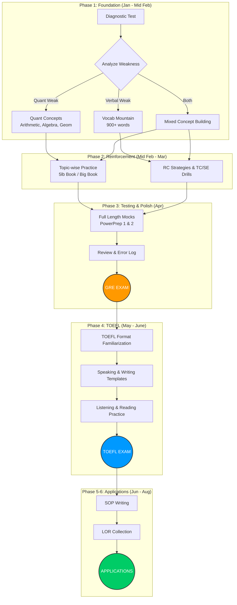
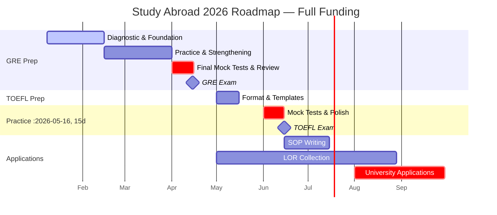

# 🎓 My Study Abroad Preparation Plan — Full Funding Goal

## 🎯 My Target Scores

| Exam | Target Score | Section Breakdown |
|:---|:---:|:---|
| **GRE** | **325+** | Quant: 165+ / Verbal: 160+ |
| **TOEFL iBT** | **110+** | R:28+ / L:28+ / S:26+ / W:28+ |

---

## 📊 Executive Summary

| **Item** | **Target Date** | **Cost (BDT)** |
| :--- | :--- | :--- |
| **GRE** | April 2026 | ৳28,500 |
| **TOEFL** | June 2026 | ৳21,800 |
| **GregMat+ (6 months)** | Jan - Jun 2026 | ~৳3,700 |
| **Total** | | **~৳54,000** |

> [!NOTE]
> *   Keeping ~৳5,000 buffer for bank fees and rate fluctuations

---

## ⏰ My Daily Study Schedule

### Plan: 3-4 Hours/Day

| Time Block | Duration | Focus Area | Best For |
|:---|:---:|:---|:---|
| **Morning** (7:00-8:30 AM) | 1.5 hrs | Vocabulary + Reading | Fresh mind for memorization |
| **Evening** (7:00-9:00 PM) | 2 hrs | Quant Practice + Review | Problem-solving after work |
| **Weekend Bonus** | +2 hrs | Full Section Practice | Timed mock sections |

### Weekly Hour Distribution

| Day | Quant | Verbal | AWA | Total |
|:---:|:---:|:---:|:---:|:---:|
| Mon-Fri | 1 hr | 1.5 hrs | - | 2.5 hrs |
| Saturday | 2 hrs | 2 hrs | 1 hr | 5 hrs |
| Sunday | 1.5 hrs | 1.5 hrs | - | 3 hrs |
| **Weekly Total** | **8 hrs** | **11 hrs** | **1 hr** | **~20 hrs** |

> [!IMPORTANT]
> **First Week Priority**: Take a diagnostic test to identify my strengths and weaknesses before diving into the detailed study.

---

## 📅 Phase 1: Diagnostic & Foundation (Jan 8 - Feb 15) — 6 Weeks

### Week 1: Diagnostic Assessment
- [ ] **Day 1-2**: Take free ETS PowerPrep 1 diagnostic test
- [ ] **Day 3**: Analyze results - identify weak areas in Quant & Verbal
- [ ] **Day 4-5**: Set up study materials (GregMat+, ETS Official Guide)
- [ ] **Day 6-7**: Begin vocabulary with first 100 Barron's 333 words

### Week 2-3: Core Concepts
| Focus | Daily Task | Goal |
|:---|:---|:---|
| **Quant** | Arithmetic, Number Properties | Master 2 topics/week |
| **Verbal** | 25 vocab words + 2 RC passages | 175 words + RC strategies |
| **AWA** | Read sample essays | Understand scoring rubric |

### Week 4-5: Building Blocks
| Focus | Daily Task | Goal |
|:---|:---|:---|
| **Quant** | Algebra, Word Problems, Geometry | Complete all core topics |
| **Verbal** | 25 words + TC/SE strategies | 350+ words mastered |
| **Practice** | 10-15 problems per topic daily | Build speed and accuracy |

### Week 6: First Checkpoint
- [ ] Take ETS PowerPrep 2 (free official mock)
- [ ] Compare with diagnostic score
- [ ] Adjust study plan based on improvement

---

## 📅 Phase 2: Reinforcement & Practice (Feb 16 - Mar 31) — 6 Weeks

### Week 7-9: Topic Mastery
| Day | Morning (1.5 hrs) | Evening (2 hrs) |
|:---|:---|:---|
| **Mon** | 30 vocab + 2 RC | Arithmetic & Ratios drills |
| **Tue** | 30 vocab + TC/SE practice | Algebra & Inequalities |
| **Wed** | Reading Comp strategies | Geometry & Coordinate |
| **Thu** | 30 vocab + 2 RC | Data Interpretation |
| **Fri** | Mixed Verbal review | Mixed Quant review |
| **Sat** | Full Verbal section (timed) | Full Quant section (timed) |
| **Sun** | Error log review | Weak area deep dive |

### Week 10-12: Mock Test Phase
| Week | Mock Test | Target Score | Focus After |
|:---:|:---|:---:|:---|
| Week 10 | Manhattan 5lb Quant | 310+ | Error analysis |
| Week 11 | Full ETS Mock | 315+ | Time management |
| Week 12 | Kaplan/Princeton Mock | 318+ | Final weak areas |

---

## 📅 Phase 3: Final GRE Push (Apr 1 - Apr 15) — 2 Weeks

### Week 13: Intensive Review
- [ ] Take 2 full-length mocks (Mon & Thu)
- [ ] Review all error logs
- [ ] Focus only on weak topics
- [ ] AWA: Write 4 practice essays

### Week 14: Exam Week
- [ ] Light review only (no new concepts)
- [ ] 1 final mock on Monday
- [ ] Rest and confidence building
- [ ] **🎯 GRE EXAM: Mid-April**

---

## 📅 Phase 4: TOEFL Preparation (May 1 - Jun 15) — 6 Weeks

### TOEFL Section Breakdown

| Section | Time | Questions | Target Score |
|:---|:---:|:---:|:---:|
| Reading | 35 min | 20 questions | 28+ |
| Listening | 36 min | 28 questions | 28+ |
| Speaking | 16 min | 4 tasks | 26+ |
| Writing | 29 min | 2 tasks | 28+ |

### Week 15-16: Format Familiarization
| Day | Focus | Duration |
|:---|:---|:---:|
| Mon-Tue | Reading passage types | 2 hrs |
| Wed-Thu | Listening note-taking | 2 hrs |
| Fri-Sat | Speaking templates | 2 hrs |
| Sunday | Writing structure | 2 hrs |

### Week 17-18: Section Practice
- [ ] Reading: 2 full passages daily
- [ ] Listening: 1 lecture + 1 conversation daily
- [ ] Speaking: Record 4 responses daily
- [ ] Writing: 1 integrated + 1 independent essay every 2 days

### Week 19-20: Mock Tests & Polish
| Week | Activity | Goal |
|:---:|:---|:---|
| Week 19 | 2 full TOEFL mocks | 105+ score |
| Week 20 | Final mock + review | 110+ score |
| | **🎯 TOEFL EXAM: Mid-June** | |

---

## 📝 Phase 5: Statement of Purpose (SOP) — Jun 15 - Jul 15

### SOP Essentials

| Element | What to Include |
|:---|:---|
| **Opening Hook** | Compelling story or motivation that sparked my interest |
| **Academic Background** | Relevant coursework, projects, research experience |
| **Professional Experience** | Work, internships, achievements related to the field |
| **Why This Program** | Specific reasons for choosing the program/university |
| **Research Interests** | Topics I want to explore, faculty I want to work with |
| **Career Goals** | Short-term and long-term objectives |
| **Why Me** | What unique perspective/skills I bring |

### SOP Timeline

| Week | Task |
|:---|:---|
| **Week 21** | Research 5-6 target universities and their specific programs |
| **Week 22** | Draft 1: Write raw first draft (no editing, just ideas) |
| **Week 23** | Draft 2: Restructure, add specific details, cut fluff |
| **Week 24** | Draft 3: Get feedback from mentors/professors, refine |
| **Week 25** | Final polish: Customize for each university |

### SOP Checklist
- [ ] Research target programs and faculty
- [ ] List my achievements, projects, and experiences
- [ ] Write Draft 1 (brain dump)
- [ ] Revise Draft 2 (structure + specifics)
- [ ] Get feedback from 2-3 people
- [ ] Create university-specific versions
- [ ] Final proofread

---

## 📜 Phase 6: Letters of Recommendation (LOR) — Start by May

### LOR Strategy

| Recommender Type | Why Important |
|:---|:---|
| **Academic Professor 1** | Can speak to my intellectual abilities, coursework performance |
| **Academic Professor 2** | Research/project supervisor who knows my work ethic |
| **Professional/Supervisor** | Work experience, leadership, real-world skills |

### LOR Timeline

| When | Task |
|:---|:---|
| **May (Early)** | Identify 3-4 potential recommenders |
| **May** | Approach them personally, explain my goals |
| **June** | Provide them with my CV, SOP draft, and talking points |
| **July** | Follow up politely, confirm they have time |
| **Aug-Sep** | Send official requests through application portals |
| **Before Deadline** | Send gentle reminders 2 weeks before due date |

### What to Provide Recommenders
- [ ] My updated CV/Resume
- [ ] My draft SOP (so they understand my goals)
- [ ] List of programs I'm applying to
- [ ] Specific points I'd like them to highlight
- [ ] Deadline dates for each university

### LOR Checklist
- [ ] Identify 3-4 recommenders
- [ ] Meet with each recommender personally
- [ ] Prepare and share support materials
- [ ] Track LOR status for each university
- [ ] Send thank-you notes after submission

---

## 🛣️ Visual Preparation Path

---

## 📅 Full Timeline Gantt Chart

---

## 📚 Resources

### Free Resources

| Resource | Focus |
|:---|:---|
| **ETS PowerPrep** | Official GRE practice tests (2 free) |
| **Magoosh Vocab App** | 1000+ GRE words (free mobile app) |
| **ETS TOEFL Practice** | Official TOEFL prep materials |

### Paid Resource

| Resource | Cost | Why I'm Using It |
|:---|:---|:---|
| **GregMat+** | $5/month (~৳612/month) | Complete GRE prep, best value for money |

---

## 💰 Cost Breakdown

### 1. GRE General Test
*   **Registration Fee**: ৳28,500
*   **Rescheduling Fee**: ~$50 (if needed)
*   **Additional Score Reports**: $27 per recipient (4 free at test center)

### 2. TOEFL iBT
*   **Registration Fee**: ৳21,800
*   **Rescheduling Fee**: ~$60 (if needed)
*   **Additional Score Reports**: $20 per recipient (4 free at test center)

### 3. Preparation Materials
*   **GregMat+**: $5/month (~৳612/month)

---

## 📈 Score Tracking

### GRE Progress

| Date | Mock Test | Quant | Verbal | Total | Notes |
|:---|:---|:---:|:---:|:---:|:---|
| Week 1 | PowerPrep 1 (Diagnostic) | - | - | - | Baseline score |
| Week 6 | PowerPrep 2 | - | - | - | Mid-checkpoint |
| Week 10 | Manhattan Mock | - | - | - | Practice |
| Week 12 | ETS Mock | - | - | - | Pre-final |
| Week 14 | Final Mock | - | - | - | Ready for exam |

### TOEFL Progress

| Date | Mock Test | R | L | S | W | Total |
|:---|:---|:---:|:---:|:---:|:---:|:---:|
| Week 16 | Diagnostic | - | - | - | - | - |
| Week 19 | Full Mock 1 | - | - | - | - | - |
| Week 20 | Full Mock 2 | - | - | - | - | - |

---

## ✅ Immediate Action Items

- [ ] **Jan 8**: Take ETS PowerPrep 1 diagnostic test
- [ ] **Jan 9**: Analyze diagnostic results & identify weak areas
- [ ] **Jan 10**: Sign up for GregMat+ ($5/month)
- [ ] **Jan 12**: Passport Check - ensure validity for 6+ months past exam
- [ ] **Week 2**: Begin vocabulary with Barron's 333 / Magoosh vocab app
- [ ] **March**: Book GRE test date for mid-April
- [ ] **April (post-GRE)**: Book TOEFL test date for mid-June
- [ ] **May**: Approach potential LOR recommenders
- [ ] **June**: Start SOP drafting
- [ ] **Before exams**: Select 4 universities for free score sends

---

## 🎯 Weekly Checkpoint Goals

| Week | Vocab Words | Quant Topics | Verbal Skills | Mock Score |
|:---:|:---:|:---|:---|:---:|
| 1-2 | 150 | Arithmetic, Percentages | RC basics | Diagnostic |
| 3-4 | 300 | Algebra, Ratios | TC/SE intro | - |
| 5-6 | 450 | Geometry, Word Problems | RC strategies | 300+ |
| 7-8 | 600 | Data Interpretation | Advanced TC/SE | 310+ |
| 9-10 | 750 | Mixed practice | Full sections | 315+ |
| 11-12 | 900 | Full mocks | AWA practice | 320+ |
| 13-14 | Review | Final polish | Error review | **325+ 🎯** |

---

**Let's do this! 💪🎓**
