# ⚔️ The Scholar's Quest — Journey to the Realm of Full Funding

> *"Every great adventure begins with a single step. Mine begins now."*

## 📑 Table of Contents

- [The Quest Overview](#-the-quest-overview)
- [Victory Conditions](#-victory-conditions)
- [Daily Training Regimen](#-daily-training-regimen)
- [Chapter I: The Awakening](#-chapter-i-the-awakening-jan-8---feb-15--6-weeks)
- [Chapter II: The Grind](#-chapter-ii-the-grind-feb-16---mar-31--6-weeks)
- [Chapter III: The First Boss Battle](#-chapter-iii-the-first-boss-battle-apr-1---apr-15--2-weeks)
- [Chapter IV: The TOEFL Trial](#-chapter-iv-the-toefl-trial-may-1---jun-15--6-weeks)
- [Chapter V: The Sacred Scroll — SOP](#-chapter-v-the-sacred-scroll--sop-jun-15---jul-15)
- [Chapter VI: Letters from the Elder Council — LOR](#-chapter-vi-letters-from-the-elder-council--lor-start-by-may)
- [The Hero's Journey Map](#️-the-heros-journey-map)
- [Grimoires & Artifacts](#-grimoires--artifacts)
- [War Chest Requirements](#-war-chest-requirements)
- [Power Level Tracking](#-power-level-tracking)
- [Immediate Quest Log](#-immediate-quest-log)
- [Weekly Milestones](#-weekly-milestones)
- 📄 [**Full Cost Breakdown**](COST_BREAKDOWN.md)

---

## 🏰 The Quest Overview

| Trial | Date of Reckoning | Gold Required (৳) |
| :--- | :--- | :--- |
| ⚔️ **The GRE Trial** | April 12, 2026 | 28,500 |
| 🗣️ **The TOEFL Trial** | June 13, 2026 | 21,800 |
| 📜 **WES Scroll Verification** | After victories | ~25,000 |
| 📖 **GregMat+ Grimoire** (6 moons) | Jan - Jun 2026 | ~3,700 |
| 🏰 **Kingdom Applications** (10 total) | Aug - Oct 2026 | ~60,000 |
| **Total Campaign Cost** | | **~৳139,000** |

> [!NOTE]
> *Application fees: 6 USA (~$75 each) + 2 Germany (free) + 1 Sweden (~$85) + 1 Denmark (free). Reserve ~৳5,000 buffer.*

---

## 🎯 Victory Conditions

| Trial | Target Power Level | Attribute Breakdown |
|:---|:---:|:---|
| ⚔️ **GRE** | **325+** | Quant: 165+ ⚡ / Verbal: 160+ 📚 |
| 🗣️ **TOEFL** | **110+** | R:28+ / L:28+ / S:26+ / W:28+ |

---

## ⏰ Daily Training Regimen

### Training Intensity: 3-4 Hours per Day

| Time of Day | Duration | Training Focus | Purpose |
|:---|:---:|:---|:---|
| 🌅 **Dawn** (7:00-8:30 AM) | 1.5 hrs | Vocabulary + Reading | Mind is sharpest at dawn |
| 🌙 **Dusk** (7:00-9:00 PM) | 2 hrs | Quant Combat + Review | Battle practice after daily duties |
| ⚔️ **Weekend Siege** | +2 hrs | Full Section Battles | Timed combat simulations |

### Weekly Training Distribution

| Day | Quant ⚡ | Verbal 📚 | AWA ✍️ | Total |
|:---:|:---:|:---:|:---:|:---:|
| Mon-Fri | 1 hr | 1.5 hrs | - | 2.5 hrs |
| Saturday | 2 hrs | 2 hrs | 1 hr | 5 hrs |
| Sunday | 1.5 hrs | 1.5 hrs | - | 3 hrs |
| **Weekly** | **8 hrs** | **11 hrs** | **1 hr** | **~20 hrs** |

> [!IMPORTANT]
> **First Week Priority**: Take the Diagnostic Trial to reveal my strengths and weaknesses before the true training begins.

---

## � Chapter I: The Awakening (Jan 8 - Feb 15) — 6 Weeks

*The hero discovers their path and begins to understand the challenges ahead...*

### Week 1: The Diagnostic Trial
- [ ] **Day 1-2**: Face the ETS PowerPrep 1 trial
- [ ] **Day 3**: Study the results — identify weak attributes
- [ ] **Day 4-5**: Acquire study artifacts (GregMat+ Grimoire, ETS Official Tome)
- [ ] **Day 6-7**: Begin memorizing the first 100 words of power

### Week 2-3: Mastering the Fundamentals
| Skill Tree | Daily Quest | Milestone |
|:---|:---|:---|
| ⚡ **Quant** | Arithmetic, Number Properties | Master 2 skills/week |
| 📚 **Verbal** | 25 words of power + 2 RC scrolls | 175 words + RC techniques |
| ✍️ **AWA** | Study ancient essay examples | Understand the scoring runes |

### Week 4-5: Building the Arsenal
| Skill Tree | Daily Quest | Milestone |
|:---|:---|:---|
| ⚡ **Quant** | Algebra, Word Problems, Geometry | Complete all fundamental skills |
| 📚 **Verbal** | 25 words + TC/SE combat tactics | 350+ words mastered |
| ⚔️ **Practice** | 10-15 problems per skill daily | Build speed and precision |

### Week 6: First Checkpoint
- [ ] Face ETS PowerPrep 2 (free official trial)
- [ ] Compare power level with initial diagnostic
- [ ] Adjust training based on growth

---

## � Chapter II: The Grind (Feb 16 - Mar 31) — 6 Weeks

*The hero trains relentlessly, pushing beyond their limits...*

### Week 7-9: Mastery Training
| Day | Dawn Training (1.5 hrs) | Dusk Training (2 hrs) |
|:---|:---|:---|
| **Mon** | 30 words + 2 RC scrolls | Arithmetic & Ratios combat |
| **Tue** | 30 words + TC/SE drills | Algebra & Inequalities |
| **Wed** | Reading Comp strategies | Geometry & Coordinate |
| **Thu** | 30 words + 2 RC scrolls | Data Interpretation |
| **Fri** | Mixed Verbal review | Mixed Quant review |
| **Sat** | Full Verbal battle (timed) | Full Quant battle (timed) |
| **Sun** | Error log analysis | Weak point training |

### Week 10-12: The Trial Simulations
| Week | Mock Battle | Target Power | Focus After |
|:---:|:---|:---:|:---|
| Week 10 | Manhattan 5lb Quant | 310+ | Error analysis |
| Week 11 | Full ETS Mock | 315+ | Time management |
| Week 12 | Kaplan/Princeton Mock | 318+ | Final weaknesses |

---

## � Chapter III: The First Boss Battle (Apr 1 - Apr 15) — 2 Weeks

*The moment of truth approaches. The hero prepares for their greatest challenge yet...*

### Week 13: Final Preparations
- [ ] Engage in 2 full mock battles (Mon & Thu)
- [ ] Review all error logs — learn from every mistake
- [ ] Focus only on weak points
- [ ] AWA: Write 4 practice essays

### Week 14: The GRE Boss Battle
- [ ] Light training only — preserve energy
- [ ] 1 final mock battle on Monday
- [ ] Rest and mental fortification
- [ ] **⚔️ BOSS BATTLE: GRE — April 12, 2026 (Saturday)**

---

## � Chapter IV: The TOEFL Trial (May 1 - Jun 15) — 6 Weeks

*A different kind of challenge awaits — one of communication and clarity...*

### Trial Format

| Section | Time Limit | Challenges | Target Score |
|:---|:---:|:---:|:---:|
| 📖 Reading | 35 min | 20 questions | 28+ |
| 👂 Listening | 36 min | 28 questions | 28+ |
| 🗣️ Speaking | 16 min | 4 tasks | 26+ |
| ✍️ Writing | 29 min | 2 tasks | 28+ |

### Week 15-16: Learning the Format
| Day | Focus | Duration |
|:---|:---|:---:|
| Mon-Tue | Reading passage types | 2 hrs |
| Wed-Thu | Listening note-taking | 2 hrs |
| Fri-Sat | Speaking incantations | 2 hrs |
| Sunday | Writing structure | 2 hrs |

### Week 17-18: Intensive Practice
- [ ] Reading: 2 full passages daily
- [ ] Listening: 1 lecture + 1 conversation daily
- [ ] Speaking: Record 4 responses daily
- [ ] Writing: 1 integrated + 1 independent essay every 2 days

### Week 19-20: Final Trials
| Week | Activity | Goal |
|:---:|:---|:---|
| Week 19 | 2 full TOEFL mocks | 105+ score |
| Week 20 | Final mock + review | 110+ score |
| | **🗣️ BOSS BATTLE: TOEFL — June 13, 2026 (Saturday)** | |

---

## � Chapter V: The Sacred Scroll — SOP (Jun 15 - Jul 15)

*The hero must now craft their legend — a scroll that tells their story...*

### Elements of the Sacred Scroll

| Element | What to Inscribe |
|:---|:---|
| 🎭 **Opening Hook** | The origin story — what sparked this quest |
| 📚 **Academic Journey** | Coursework, projects, research quests completed |
| ⚔️ **Battle Experience** | Work, internships, achievements in the field |
| 🏰 **Why This Kingdom** | Specific reasons for choosing each realm |
| 🔮 **Research Dreams** | Topics to explore, mentors to seek |
| 🌟 **Destiny** | Short-term and long-term vision |
| 💎 **Unique Gifts** | What makes me different from other adventurers |

### SOP Timeline

| Week | Quest |
|:---|:---|
| **Week 21** | Scout 5-6 target kingdoms and their programs |
| **Week 22** | Draft 1: Raw thoughts onto parchment |
| **Week 23** | Draft 2: Restructure, add details, remove fluff |
| **Week 24** | Draft 3: Seek wisdom from mentors, refine |
| **Week 25** | Final polish: Customize for each kingdom |

### SOP Quest Log
- [ ] Research target programs and faculty
- [ ] List my achievements, projects, and experiences
- [ ] Write Draft 1 (unfiltered thoughts)
- [ ] Revise Draft 2 (structure + specifics)
- [ ] Get feedback from 2-3 wise counselors
- [ ] Create kingdom-specific versions
- [ ] Final proofread

---

## 📜 Chapter VI: Letters from the Elder Council — LOR (Start by May)

*The hero seeks endorsement from powerful allies who have witnessed their journey...*

### The Council Members

| Elder Type | Their Testimony |
|:---|:---|
| 🧙 **Academic Elder 1** | Speaks of intellectual prowess, coursework mastery |
| 🧙 **Academic Elder 2** | Research/project guide who witnessed dedication |
| ⚔️ **Professional Mentor** | Work experience, leadership, real-world skills |

### LOR Timeline

| When | Quest |
|:---|:---|
| **May (Early)** | Identify 3-4 potential council members |
| **May** | Approach them personally, explain the journey |
| **June** | Provide CV, SOP draft, and key talking points |
| **July** | Follow up respectfully, confirm availability |
| **Aug-Sep** | Send official requests through kingdom portals |
| **Before Deadline** | Gentle reminders 2 weeks before due date |

### Materials for the Elders
- [ ] Updated CV/Resume scroll
- [ ] Draft SOP (so they understand my quest)
- [ ] List of kingdoms I'm applying to
- [ ] Specific deeds I'd like them to highlight
- [ ] Deadline dates for each kingdom

### LOR Quest Log
- [ ] Identify 3-4 elder council members
- [ ] Meet with each elder personally
- [ ] Prepare and share support materials
- [ ] Track LOR status for each kingdom
- [ ] Send gratitude scrolls after submission

---

## �️ The Hero's Journey Map

```mermaid
graph TD
    subgraph "Chapter I: The Awakening (Jan - Mid Feb)"
        A[Diagnostic Trial] --> B{Reveal Weaknesses}
        B -->|Quant Weak| C[Quant Training<br>Arithmetic, Algebra, Geom]
        B -->|Verbal Weak| D[Vocabulary Mountain<br>900+ words of power]
        B -->|Both| E[Mixed Training]
    end

    subgraph "Chapter II: The Grind (Mid Feb - Mar)"
        C --> F[Intensive Practice<br>5lb Book / Big Book]
        D --> G[RC Strategies & TC/SE Drills]
        E --> F
        E --> G
    end

    subgraph "Chapter III: Boss Battle (Apr)"
        F --> H[Full Mock Battles<br>PowerPrep 1 & 2]
        G --> H
        H --> I[Error Log Review]
        I --> J((⚔️ GRE BOSS))
    end
    
    subgraph "Chapter IV: TOEFL (May - June)"
        J --> K[TOEFL Format Training]
        K --> L[Speaking & Writing Templates]
        L --> M[Listening & Reading Practice]
        M --> N((🗣️ TOEFL BOSS))
    end

    subgraph "Chapter V-VI: Applications (Jun - Aug)"
        N --> O[SOP Crafting]
        O --> P[LOR Collection]
        P --> Q((🏰 FULL FUNDING))
    end

    style J fill:#ff9900,stroke:#333,stroke-width:2px,color:white
    style N fill:#0099ff,stroke:#333,stroke-width:2px,color:white
    style Q fill:#00cc66,stroke:#333,stroke-width:2px,color:white
```

---

## � Grimoires & Artifacts

### Free Artifacts

| Artifact | Power |
|:---|:---|
| 📜 **ETS PowerPrep** | Official GRE trial simulations (2 free) |
| 📱 **Magoosh Vocab App** | 1000+ words of power (free) |
| 🎧 **ETS TOEFL Practice** | Official TOEFL training materials |

### Purchased Grimoire

| Grimoire | Cost | Why I Chose It |
|:---|:---|:---|
| 📖 **GregMat+** | $5/moon (~৳612/moon) | Complete GRE mastery, legendary value |

---

## 💰 War Chest Requirements

### ⚔️ The GRE Trial
*   **Entry Fee**: ৳28,500
*   **Extra Score Scrolls**: $27 per recipient (4 free at trial)

### 🗣️ The TOEFL Trial
*   **Entry Fee**: ৳21,800
*   **Extra Score Scrolls**: $20 per recipient (4 free at trial)

### 📜 WES Scroll Verification
*   **Course-by-Course Evaluation**: ~$205 (~৳25,000)
*   Includes international raven delivery

### 📖 Training Materials
*   **GregMat+ Grimoire**: $5/moon (~৳612/moon)

---

## 📈 Power Level Tracking

### GRE Progress

| Week | Trial | Quant ⚡ | Verbal 📚 | Total | Notes |
|:---|:---|:---:|:---:|:---:|:---|
| Week 1 | PowerPrep 1 (Diagnostic) | - | - | - | Starting power level |
| Week 6 | PowerPrep 2 | - | - | - | Mid-journey check |
| Week 10 | Manhattan Mock | - | - | - | Training battle |
| Week 12 | ETS Mock | - | - | - | Pre-boss check |
| Week 14 | Final Mock | - | - | - | Ready for boss |

### TOEFL Progress

| Week | Trial | R | L | S | W | Total |
|:---|:---|:---:|:---:|:---:|:---:|:---:|
| Week 16 | Diagnostic | - | - | - | - | - |
| Week 19 | Full Mock 1 | - | - | - | - | - |
| Week 20 | Full Mock 2 | - | - | - | - | - |

---

## ⚡ Immediate Quest Log

- [ ] **Jan 8**: Face the ETS PowerPrep 1 diagnostic trial
- [ ] **Jan 9**: Analyze results & identify weak attributes
- [ ] **Jan 10**: Acquire the GregMat+ Grimoire ($5/moon)
- [ ] **Jan 12**: Passport Check — ensure validity for 6+ moons past trials
- [ ] **Week 2**: Begin vocabulary training with Barron's 333 / Magoosh app
- [ ] **March**: Book GRE trial date
- [ ] **April (post-GRE)**: Book TOEFL trial date
- [ ] **May**: Approach potential LOR elder council members
- [ ] **June**: Begin crafting the Sacred SOP Scroll
- [ ] **Before trials**: Select 4 kingdoms for free score sends

---

## 🎯 Weekly Milestones

| Week | Words of Power | Quant Skills | Verbal Skills | Power Level |
|:---:|:---:|:---|:---|:---:|
| 1-2 | 150 | Arithmetic, Percentages | RC basics | Diagnostic |
| 3-4 | 300 | Algebra, Ratios | TC/SE intro | - |
| 5-6 | 450 | Geometry, Word Problems | RC strategies | 300+ |
| 7-8 | 600 | Data Interpretation | Advanced TC/SE | 310+ |
| 9-10 | 750 | Mixed practice | Full sections | 315+ |
| 11-12 | 900 | Full mocks | AWA practice | 320+ |
| 13-14 | Review | Final polish | Error review | **325+ 🎯** |

---

*"The path to glory is paved with discipline. The hero who trains hardest wins."*

**⚔️ The Quest Begins! ⚔️**
